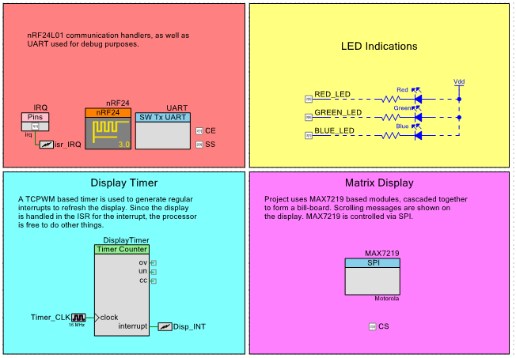
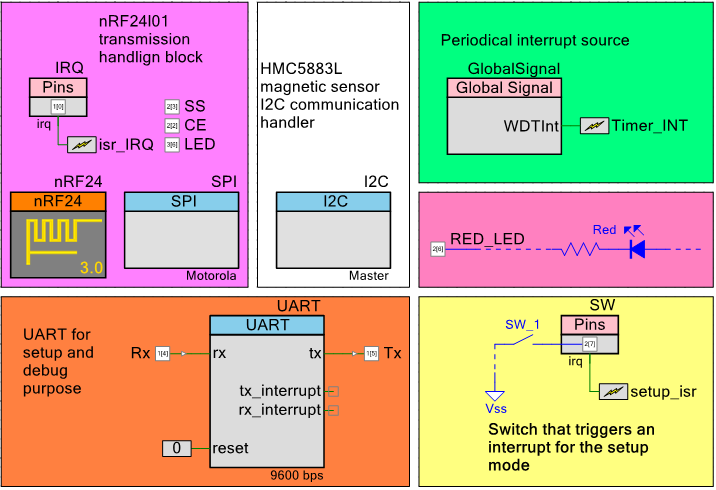

# Smart Parking

All the informatino can be found in the attached presentation.

Many thanks to my mentors for helping with the project:
- Taras Dominyuk - Infenion
- Oleg Farenyuk - Professor at APPS UCU

## Demonstration
Please look at the exemple of execution:
https://www.youtube.com/watch?v=wYSM8OyWwoo&feature=youtu.be

## Schemes

### Host-display unit

### Sensor-node unit

## Contributing
- one can easily build the project basing on the schemes and generated zip-files with project
- all the papers related to the topics can be found in project materials
- Contributions are what make the open source community such an amazing place to learn, inspire, and create. Any contributions you make are **greatly appreciated**.

If you have a suggestion that would make this better, please fork the repo and create a pull request. You can also simply open an issue with the tag "enhancement".
Don't forget to give the project a star! Thanks again!

1. Fork the Project
2. Create your Feature Branch (`git checkout -b feature/AmazingFeature`)
3. Commit your Changes (`git commit -m 'Add some AmazingFeature'`)
4. Push to the Branch (`git push origin feature/AmazingFeature`)
5. Open a Pull Request

## License
Distributed under the MIT License. See `LICENSE.txt` for more information.
