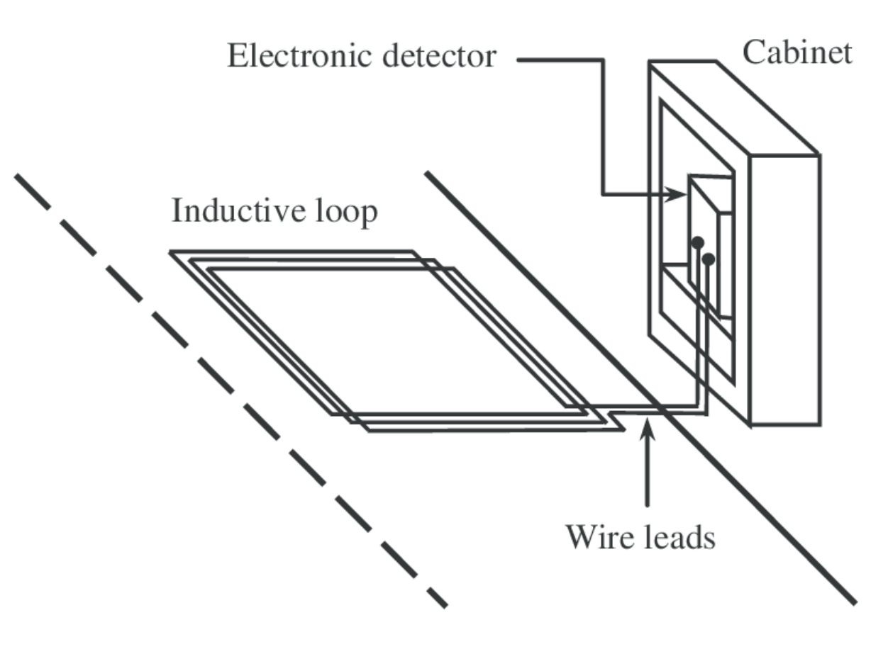
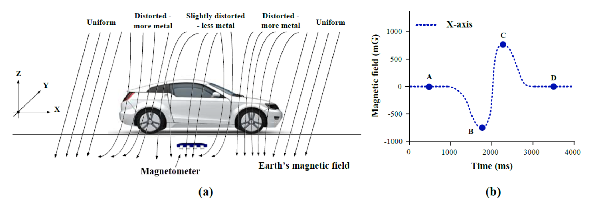
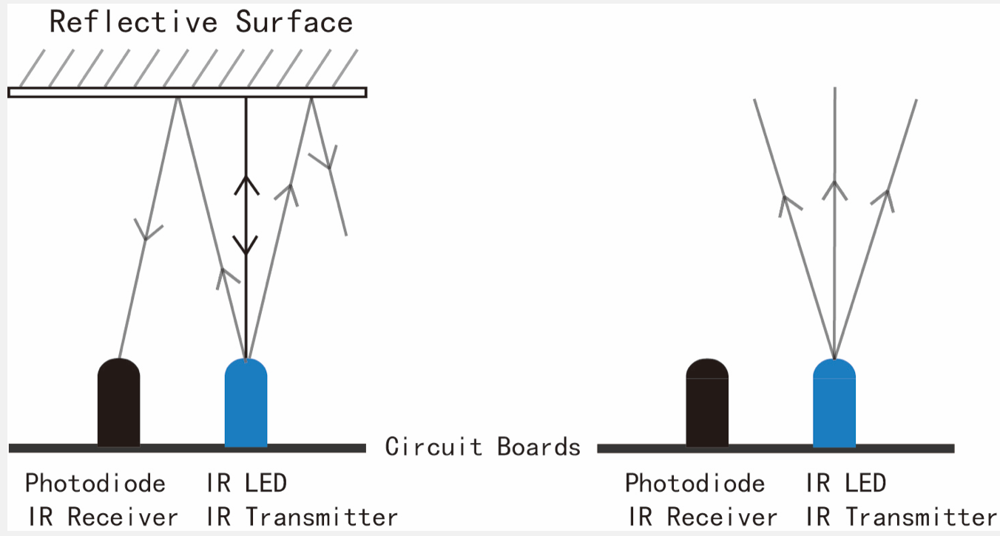

## Different smart parking implementations

##### Table of Contents  
- [In-roadway detectors](#inroadway)
- [Off-roadway](#offroadway)  

### Inroadway

***Pros***:
- resistant to weather
- reliable
- accurate
  
***Cons***:
- complicated installation
- possibility of damage
- complicated maintanance
 

## Most common approaches:
**Inductive loop detectors**
- note disturbace in the magnetic field, generated by the loop (electromagnetic induction)
- requires underground electrical wire

**Magnetic detectors / Magnetometers**
- detect local disturbance in the earth's magnetic field caused by a vehicle.
- proper calibration of every detector is crucial for detection reliability level
- can be buried under the ground (to avoid vandalism)
- resistent to bad weather conditions
- cannot be used in a certain latitudes (magnetic equator), where angle of magnetic field is to low.
- working principle of a digital compass module uses the magneto-resistance property of a material which refers to the ability of a material to alter its electrical resistance in response to the applied external magnetic field

**Infrared detectors**
- "Infrared sensors or the IR sensors are low frequency light emitting diodes which are placed strategically in each parking slot all over the parking facility. Each IR used in the system is a passive IR sensor which must be continuously in working phase and send its data to the server in real time. The hardware interfaces the data from IR sensors to the server. While reading this data in a continuous feed the server has predefined threshold limits to check if a car is parked in the parking slot or is it vacant".
- the sensitivity of the sensor is reduced in heavy rain, snow, leaves or dense fog

### Offroadway
- easy to install and move
- easy to maintain
- lower reliability in bad weather conditions
- ofthen need to place the detector on a higher place above the ground

**Ultrasonic**
- use a sonar-like sound pulse (detectors are calibrated with the known distance from detector to pavement and can then note a difference in echo time to determine the presence of a vehicle)
- performance can be impacted by extreme wind and temperature

**Videodetection**
- expensive 
- affected by the level of light

Sources:
- https://www.interreg-central.eu/Content.Node/DT211-Transnational-review-for-smart-parking-solutions.pdf
- Lamas, Jose & Castro-Castro, Paula-Maria & Dapena, Adriana & Vazquez-Araujo, Francisco. (2016). SiDIVS: Simple Detection of Inductive Vehicle Signatures with a Multiplex Resonant Sensor. Sensors. 16. 1309. 10.3390/s16081309.
- https://ee.farnell.com/smart-parking-solutions-the-iot-sensors-space-race 
- https://research.ijcaonline.org/volume111/number15/pxc3901499.pdf